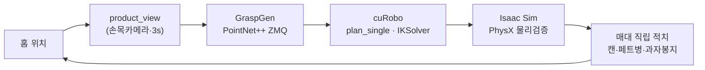

# 매대 정리 Pick-and-Place 로봇 — GraspGen → cuRobo → Isaac Sim

물체(캔 · 페트병 · 과자봉지) 3종을 인식해 **무충돌로 집어 3단 매대에 직립 적치**하는 픽앤플레이스 파이프라인.  
AI 파지 추론(GraspGen) → 충돌회피 모션플래닝(cuRobo) → 물리 검증(Isaac Sim)을 단일 검증 파이프라인으로 연결했습니다.

> **로봇** Doosan E0509 + RH-P12-RN-A 그리퍼 · **환경** NVIDIA Isaac Sim 5.1 · **모션** cuRobo v0.7.8 · **파지** GraspGen (PointNet++)

<!--  -->
**[▶ 데모 영상 추가 예정]** — 3종 물체 풀사이클 (product_view → 파지 → 리프트 → 운반 → 매대 적치)

---

## 동작 순서

```
홈 위치
  └─ product_view (손목 카메라 인식 자세, 3초 대기)
       └─ GraspGen 추론 (점구름 → 파지 자세 후보)
            └─ cuRobo plan_single (충돌회피 approach)
                 └─ 파지 (그리퍼 닫기)
                      └─ lift → carry (cuRobo plan_single)
                           └─ moveL 직선 진입 (+y, IK)
                                └─ 적치 (그리퍼 열기)
                                     └─ moveL 직선 후퇴 (-y)
                                          └─ 홈 복귀
                                               └─ (다음 물체 반복)
```



---

## 사이클 타임 실측 (Isaac Sim, 2026-06-23)

| 물체 | 파지 | 운반 | 적치 | 홈복귀 | **합계** |
|------|------|------|------|--------|---------|
| 캔 | 30.7s | 6.1s | 3.2s | 4.2s | **44.1s** |
| 페트병 | 34.8s | 5.9s | 3.4s | 4.5s | **48.6s** |
| 과자봉지 | 17.6s | 4.1s | 17.4s | 13.7s | **52.8s** |
| **3종 합계** | | | | | **≈ 145s (2분 25초)** |

요구사양 3분 이내 **달성**.

---

## 핵심 결과

| 지표 | 결과 | 방법 |
|------|------|------|
| joint_2 추종오차 | 4.55° → **0.17°** (96%↓) | 중력보상 피드포워드 |
| 풀사이클 무충돌 | **3종 클린런 달성** | cuRobo `plan_single`, 전 구간 |
| 과자봉지 물리 적치 | **FixedJoint 추종 + 중력 낙하** | 그리퍼 틸트(-25°) 추종 후 오픈 시 자연 안착 |
| 손목 카메라 뷰 | **RealSense D455 듀얼 뷰포트** | Isaac Sim 2분할 뷰포트(로봇뷰 + 카메라뷰) |
| 그리퍼 스트로크 (sim vs 실물) | **105 ≈ 106mm** | 실측 비교 → USD 교체 불필요 입증 |

---

## 핵심 기술

- **씬 구축** — E0509 + RH-P12-RN-A USD 씬, URDF→USD, 충돌구체(Lula/XRDF) 저작
- **모션 플래닝** — cuRobo `plan_single` / `plan_single_js` / `IKSolver` (v1 API), `move_linear_ik` SVD 직선보간
- **파지 추론** — GraspGen 6-DOF 파지 ZMQ 서버, 캔/병 side-grasp 합성, 비대칭 관절한계 IK 분기 제어
- **변형체 시뮬** — 과자봉지 FixedJoint 틸트 추종 + PhysX 중력 낙하 적치
- **물리 검증** — 충돌·접촉·파지, 중력보상(j2 피드포워드), product_view 인식 사이클 구현

---

## 실행 방법

```bash
# 1. GraspGen 서버 기동 (별도 터미널)
bash ~/shelf_grasp_dev/start_graspgen_server.sh

# 2. 3종 픽앤플레이스 실행
bash ~/shelf_grasp_dev/stages/pipeline/run_stage8.sh --mixed --rigid-bag --place

# 과자봉지만 단독 테스트
bash ~/shelf_grasp_dev/stages/pipeline/run_stage8.sh --mixed --rigid-bag --place --snack-only

# 종료
touch /tmp/stage7_stop
```

---

## 디렉토리

```
stages/pipeline/
  stage8_main.py      메인 파이프라인 (3종 픽앤플레이스)
  pp_motion.py        move_linear_ik (직선보간 IK)
  pp_geometry.py      side_grasp_from_approach (파지 자세 합성)
  pp_phases.py        FSM 단계 정의
  run_stage8.sh       Isaac Sim 런처 (dGPU 오프로드)
snack_bag/
  snack_jog.py        펜던트 스타일 TCP jog 도구
integration/          모션팀 이관 패키지 (cuRobo 플래너 + ROS2 인터페이스)
docs/                 아키텍처·파이프라인 문서
```

---

## 환경

RTX 5080 (Blackwell) · CUDA 12.8 / torch cu128 · Isaac Sim 5.1 · cuRobo v0.7.8 (v1 API) · ROS2 Humble

---

*포트폴리오 상세(트러블슈팅·의사결정)는 Notion 포트폴리오에서 확인하실 수 있습니다.*
