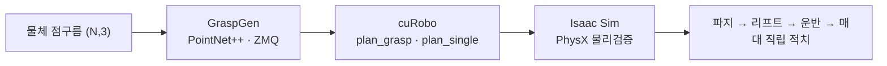

# 매대 정리 Pick-and-Place 로봇 — GraspGen → cuRobo → Isaac Sim

물체(캔/병/스낵)를 인식해 **무충돌로 집어 3단 매대에 직립 적치**하는 픽앤플레이스 파이프라인.
AI 파지 추론(GraspGen) → 충돌회피 모션플래닝(cuRobo) → 물리 검증(Isaac Sim)을 하나의 검증 가능한 파이프라인으로 연결했습니다.

> 로봇 **Doosan E0509 + RH-P12-RN-A 그리퍼** · 환경 **NVIDIA Isaac Sim 5.x / Isaac Lab** · 모션 **cuRobo v0.7.8** · 파지 **GraspGen(PointNet++)**

<!-- 데모: docs/demo.gif 를 추가하면 아래가 표시됩니다 (클린런 전체 사이클) -->
<!--  -->
**[▶ 데모 GIF 위치 — `docs/demo.gif` 추가 예정]** (파지 → 리프트 → 운반 → 매대 직립 적치)

---

## 파이프라인



## 핵심 결과 (Isaac Sim 검증)

| 지표 | 결과 | 방법 |
|---|---|---|
| joint_2 추종오차 | 4.55° → **0.17°** (96%↓) | 중력보상 피드포워드 |
| 풀사이클 무충돌 | **클린런 (2026-06-10)** | cuRobo `plan_single`, 전 구간 |
| 그리퍼 스트로크 (sim vs 실물) | **105 ≈ 106mm** | 실측 비교 → USD/메시 교체 불필요 입증 |

## 핵심 기술

- **환경·씬 구축** — E0509 로봇/그리퍼 USD 씬, URDF→USD 변환, 충돌구체(Lula/XRDF) 저작
- **모션 플래닝** — cuRobo `plan_grasp`(goalset)로 월드(매대·이웃물체) 기준 충돌 없는 파지 후보 자동 선택, 비대칭 관절한계 URDF로 IK 분기 제어
- **파지 추론** — GraspGen 6-DOF 파지(ZMQ 추론 서버), 대칭 캔 side-grasp 합성
- **물리 검증** — PhysX 충돌·접촉·파지, 중력보상, 변형체(과자봉지) PBD particle cloth
- **강화·모방학습** — Isaac Lab Manager-based RL / IL(SkillGen) *(`pen_grasp` 계열, 별도 트랙)*

## 디렉토리

```
stages/            Stage1~7 (GraspGen→cuRobo→Isaac Sim 픽앤플레이스)
integration/       모션팀 이관 패키지 (cuRobo 플래너 코어 + ROS2 노드 + 인터페이스 계약)
multiobj_pipeline/ 다물체 클러터 파이프라인 (plan_grasp goalset)
snack_bag/         변형체(과자봉지) 시뮬
docs/              아키텍처·파이프라인 문서
```

## 환경

RTX 5080 (Blackwell) · CUDA 12.8 / torch cu128 · Isaac Sim 5.1 / Isaac Lab v2.3.2 · cuRobo v0.7.8 (v1 API) · ROS2

---

*포트폴리오 상세(프로젝트별 트러블슈팅·의사결정 과정)는 Notion 포트폴리오에서 확인하실 수 있습니다.*
