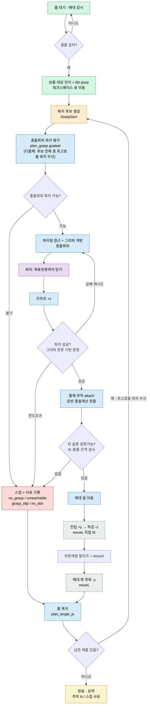

# 픽앤플레이스 동작 흐름 (구현 기준 · 2026-06-12 수정본)

수정 반영: ① 비전 파지/유지 확인 제거(비전=탐지·6D pose까지만, 파지 성공은 그리퍼 전류 판정)
② 다물체 선택 = 매대측 우선 ✗ → 충돌회피 파지 가능한 것 중 **최고 효율 파지 먼저** ✓.
Vision은 Mock(시뮬 pose 주입), 그리퍼 전류제어는 잠정(sim은 위치제어+SDF 접촉).

## 흐름도 (Mermaid)

## 단계별 기능표 (제품 1개 기준)

| 순서 | 기능 | 로봇 | Vision | GraspGen | cuRobo | 그리퍼(전류) | GUI |
|---|---|---|---|---|---|---|---|
| 1 | 매대 감시 | 홈포지션 | 매대 모니터링 | – | 대기 | 개방 유지 | 매대 상태 |
| 2 | 결품 감지 | 홈포지션 | 제품 사라짐 확인 | – | – | – | 결품 알림 |
| 3 | 없어진 제품 찾기 | 워크스페이스 확인 포지션 | 보충대상 인식 + 6D pose | – | 비전 포지션 이동 | – | 인식 결과 |
| 4 | 파지점 생성·선택 | 확인 포지션 유지 | 점구름/pose 제공 | 파지 후보 생성 | 최적 선택(plan_grasp goalset) | 개방 유지 | 후보 시각화 |
| 5 | 파지점 접근(충돌회피) | 파지점 이동 | – | – | 충돌회피 접근 | 접근 전 개방 | 궤적/충돌 |
| 6 | 파지 | 파지자세 유지 | – | – | 시작상태 충돌 해제 | 목표전류까지 닫기(물체별) | 파지 확인 |
| 7 | 리프트·파지확인 | +z 상승 | – | – | 충돌회피 상승 + attach | 전류 기반 성공 판정 | 물리파지 판정 |
| 8 | 매대 앞 이동 + 슬롯선택 | 매대 앞 이동 | – | – | 운반 + 슬롯 IK·간격 검사 | 전류 유지 | 운반/적치위치 |
| 9 | 제품 매대 적치 | MoveL +y진입→-z하강 | – | – | moveL 직접IK + detach | 부분개방(GRIP_RELEASE) | 적치 완료 |
| 10 | 매대 밖 후퇴 | MoveL -y 후퇴 | – | – | moveL 직접IK | 개방 | 후퇴 상태 |
| 11 | 홈위치 복귀 | 홈포지션 | – | – | 충돌회피 복귀(plan_single_js) | 개방 | 사이클 완료 |

색상: 초록=Vision · 주황=GraspGen · 파랑=cuRobo · 회색=로봇/moveL · 보라=그리퍼 · 빨강=스킵 · 노랑=완료.
비전은 1~4단계(탐지·6D pose)만. 9번 적치의 진입/하강·10번 후퇴는 cuRobo 플래닝이 아니라 직접 IK moveL.

## 다물체(2개+) 추가 규칙

- **선택 정책**: 매대측 우선 ✗ → 남은 제품 전체에 대해 충돌회피 파지(plan_grasp) 평가 후
  **집을 수 있는 것 중 파지 효율(모션 비용/도달성)이 최고인 파지점을 먼저** 집는다.
- 빈 슬롯 점유맵 + 실현성 사전검사(IK·충돌·기적치 간격 ≥0.125m), 불가 제품 스킵·사유 기록, 사이클마다 홈복귀.
- ★코드 현황: stage5는 아직 매대측 우선(proximity-first). 효율 우선으로 교체는 Stage7 작업. [[context-notes]]
